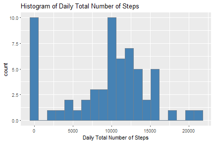
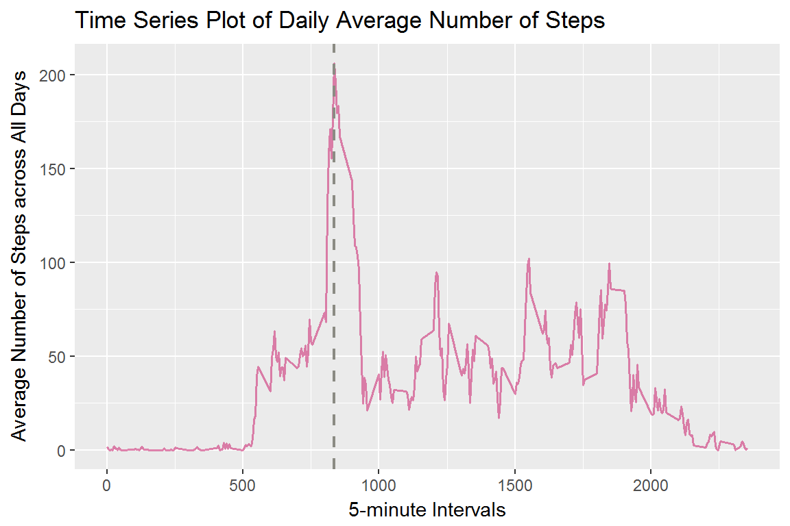
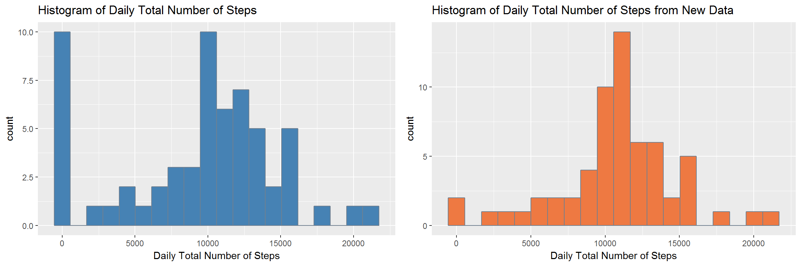
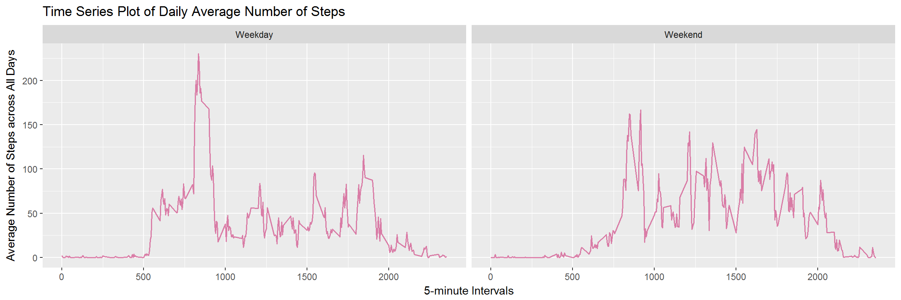

This assignment askes us to first download and process the data into a suitable format for later analysis, and then transform and plot the data according to different questions. Finally, a **single R markdown** document that can be processed by knitr and be transformed into an HTML file need to be completed and pushed up to Github.

The underlying dataset is from this website: <https://d396qusza40orc.cloudfront.net/repdata%2Fdata%2Factivity.zip>.

The GitHub repository we forked is from here: <https://github.com/rdpeng/RepData_PeerAssessment1>.

### Loading and Preprocessing the Data
In this section we load the data and change the date into Date format and cache it. Then take a look at the first several lines.


```r
mydata <- read.csv("activity.csv",na.strings = "NA") #read the data
mydata$date <- as.Date(mydata$date,"%Y-%m-%d") #change the date as classe Date
head(mydata)
```

```
##   steps       date interval
## 1    NA 2012-10-01        0
## 2    NA 2012-10-01        5
## 3    NA 2012-10-01       10
## 4    NA 2012-10-01       15
## 5    NA 2012-10-01       20
## 6    NA 2012-10-01       25
```

### Mean/Total Number of Steps Taken per Day
First of all make a histogram of the total number of steps taken each day as below:


```r
Sys.setlocale("LC_TIME","English")
library(dplyr) #load the packages we need later
library(ggplot2)
```

```r
totalnum <- mydata %>%   #group the data by date and then calculate the sum
            group_by(date) %>% 
            summarise( total = sum(steps,na.rm=T))

p1 <- qplot(total,     #plot it and make the color and labels
      data=totalnum,
      geom="histogram",
      bins=20,
      main = "Histogram of Daily Total Number of Steps",
      xlab = "Daily Total Number of Steps",
      fill = I("steelblue"),
      col = I("slategrey")
      )

print(p1)
```



Then we are going to show the mean and median total number of steps taken each day by following steps:


```r
library(knitr)
#calculate the mean and median total number of steps
meanstp <- mean(totalnum$total,na.rm=T)
medianstp <- median(totalnum$total,na.rm=T)
totalmm <- data.frame("Mean_of_Total_Steps"=meanstp,
                      "Median_of_Total_Steps"=medianstp) 

kable(totalmm,   #put the data into a table
      digits=2,
      caption = "Daily Mean and Median Number of Steps")
```


| Mean_of_Total_Steps| Median_of_Total_Steps|
|-------------------:|---------------------:|
|             9354.23|                 10395|

### The Average Daily Activity Pattern
In this section we are going to make a plot that could show how the average number of steps taken across all days varies according to the 5-minute interval. 


```r
average <- mydata %>%   #group the data by interval and then calculate the mean
            group_by(interval) %>% 
            summarise( average_across_days = mean(steps,na.rm=T))

#determine the 5-min interval with highest average steps
maximum <- average$interval[which.max(average$average_across_days)]

 #plot it and make the color and labels
ggplot(average,aes(interval,average_across_days))+
        geom_line(na.rm = T,colour = "violetred3",lwd=0.6,alpha=.6)+
        ggtitle("Time Series Plot of Daily Average Number of Steps")+
        xlab ("5-minute Intervals")+
        ylab("Average Number of Steps across All Days")+
        geom_vline(xintercept = maximum,linetype=2,colour = "ivory4",lwd=0.8)
```



Then we could also answer the quetion: Which 5-minute interval, on average across all the days in the dataset, contains the maximum number of steps?

```r
maximum
```

```
## [1] 835
```

### Imputing Missing Values
We need to deal with missing values in this case. First, let us have a look that how many missing value are there in rows of our data.


```r
table(is.na(mydata$steps))
```

```
## 
## FALSE  TRUE 
## 15264  2304
```

As what we could see, there are **2304** NAs in the dataset. Here we have to develope a strategy for filling in all of the missing values in the dataset. The idea is when an NA is appearing, first we consider the mean number of steps taken in the same day if it is not NA as well, otherwise we use the daily average number of steps in the same 5-minute interval, which can make sure that there would be no NAs after using our strategy because the daily average number of steps contains no NAs.


```r
#calculate the mean and median number of steps taken per day
mmnum <- mydata %>%   #group the data by date 
            group_by(date) %>% 
            summarise( Mean_of_Steps = mean(steps,na.rm=T), 
                       Median_of_Steps = median(steps,na.rm=T))
```


```r
#check how many NAs in the mean number of steps taken each day 
table(is.na(mmnum$Mean_of_Steps))
```

```
## 
## FALSE  TRUE 
##    53     8
```

```r
#check how many NAs in the daily average number of steps in 5-min interval 
table(is.na(average$average_across_days))
```

```
## 
## FALSE 
##   288
```

Now we fill in all the missing values with the strategy described above.


```r
#Here is the stratege for imputing missing data
fillin <- function(dat){
        long <- length(dat$steps)
        for(i in 1:long){
              if(is.na(dat$steps[i])== "TRUE"){
                      x <- subset(mmnum,date == dat$date[i])
                      y <- subset(average,interval == dat$interval[i])
                      
                      if(is.na(x$Mean_of_Steps)== "FALSE"){
                           dat$steps[i] <- x$Mean_of_Steps  
                      }else{
                           dat$steps[i] <- y$average_across_days
                      }
              }
        }
        dat
}

#Create a new dataset with the missing data filled in
newdata <- fillin(mydata)
head(newdata)
```

```
##       steps       date interval
## 1 1.7169811 2012-10-01        0
## 2 0.3396226 2012-10-01        5
## 3 0.1320755 2012-10-01       10
## 4 0.1509434 2012-10-01       15
## 5 0.0754717 2012-10-01       20
## 6 2.0943396 2012-10-01       25
```

Now we make a histogram of the total number of steps taken each day without missing values (right) and compare it with the old one (left).

```r
totalnum_new <- newdata %>%   #group the data by date and then calculate the sum
            group_by(date) %>% 
            summarise( total = sum(steps,na.rm=T))

p2 <- qplot(total,     #plot it and make the color and labels
      data=totalnum_new,
      geom="histogram",
      bins=20,
      main = "Histogram of Daily Total Number of Steps from New Data",
      xlab = "Daily Total Number of Steps",
      fill = I("sienna2"),
      col = I("slategrey")
      )

require(gridExtra)
grid.arrange(p1, p2, ncol=2)
```



From the plot above we could conclude that occurance of the value 0 extremely decreases in the new data. Meanwhile, the peak moves a little bit to the right. Form my point of view, the plot with new data looks more reasonable, because it fits better with nature movements.

It is time for us to calculate the mean and median total number of steps taken per day and compare it to the old data.


```r
#calculate the mean and median total number of steps for new data
meanstp_new <- mean(totalnum_new$total,na.rm=T)
medianstp_new <- median(totalnum_new$total,na.rm=T)
totalmm_new <- data.frame("Mean_of_Total_Steps_New"=meanstp_new,
                          "Median_of_Total_Steps_New"=medianstp_new) 

total_compare <- cbind(totalmm,totalmm_new)

kable(total_compare,   #put the data into a table
      digits=2,
      caption = "Daily Mean and Median Number of Steps with NAs and without NAs")
```


| Mean_of_Total_Steps| Median_of_Total_Steps| Mean_of_Total_Steps_New| Median_of_Total_Steps_New|
|-------------------:|---------------------:|-----------------------:|-------------------------:|
|             9354.23|                 10395|                10766.19|                  10766.19|

From the table above, it shows that after applying the new data, the mean and median total number of steps taken per day increased a bit and in the new data case, mean and median are equal to each other, which indicates that the distribution can be assumed to be approximately symmetrical. The plot above gives a hint about this conclusion as well.

### Differences in Activity Patterns between Weekdays and Weekends
Two plots are going to be made in this section to show the comparison between the average number of steps taken per 5-minute interval across weekdays and weekends. First we need to construct a function which could tell the dates to be weekdays or not. Then we create a new column in the new dataset with two levels -- "weekday" and "weekend" indicating whether a given date is a weekday or weekend day.


```r
#write a function to tell the date is weekday or weekend
deterweekdays <- function(oneday){
        weekvec <- c("Monday","Tuesday","Wednesday","Thursday","Friday")
        if(weekdays(oneday) %in% weekvec){"Weekday"}else{"Weekend"}
}

#for every date, add the weekday/weekend information at the end column
weekstep <- newdata %>%
            mutate(level = sapply(newdata$date,FUN=deterweekdays))
```

Finally we make a panel plot containing a time series plot of the 5-minute interval and the average number of steps taken, averaged across all weekday days or weekend days.


```r
#group the data by interval and then calculate the mean
average_new <- weekstep %>%   
            group_by(interval,level) %>% 
            summarise( average_across_days = mean(steps,na.rm=T))

 #plot it and make the color and labels
ggplot(average_new,aes(interval,average_across_days))+
        geom_line(na.rm = T,colour = "violetred3",lwd=0.6,alpha=.6)+
        ggtitle("Time Series Plot of Daily Average Number of Steps")+
        xlab ("5-minute Intervals")+
        ylab("Average Number of Steps across All Days")+
        facet_grid(.~level)
```


